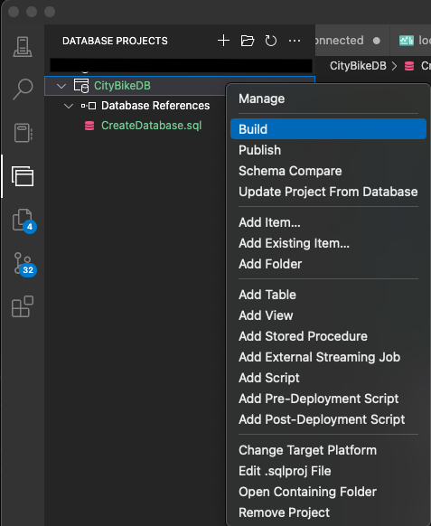
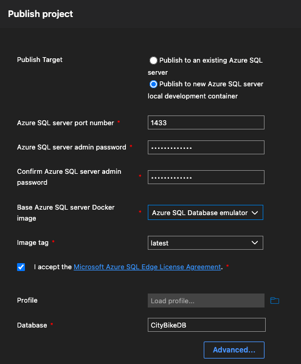
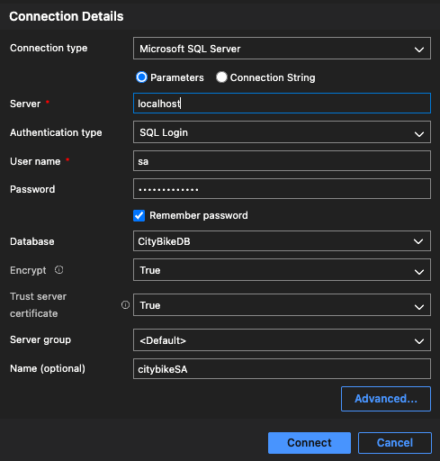

# Helsinki city bike app

This project is created to show data of journeys made with Helsinki City Bikes and this is inspired by https://github.com/solita/dev-academy-2023-exercise

## Tech stack

As a database I'm using Azure SQL Emulator running in Docker.
Backend is built with .NET 6 and
client is made with React and styled with Material UI.

## Getting started, build up the database

To follow these instructions, you need to have Docker installed.

1. Open Azure Data Studio and make sure, you have "SQL Database Projects" -extension installed.
   
2. In "Database Projects" -tab open existing project "CityBikeDB" which is located in the root of cloned project folder.
3. Build project and check, that there are no errors.
   
4. Publish project to Docker (creates new container, where the database will be running)
      - Choose "Publish to new Azure SQL server local development container".
      - Use default port 1433
      - Define server admin password (later you need to connect to database for inserting data, so remember the password)
      - Choose "Azure SQL Database emulator Lite" as Docker image
      - Make sure, that the database name is "CityBikeDB"
        
5. Copy source data files to Docker container
      - Using terminal cd to the projects root folder
      - Copy the whole "DataToImport" -directory to the Docker container (created in the previous step) using command `docker cp DataToImport <CONTAINER_ID>:/var/opt`
           - `<CONTAINER_ID>` is the 12-character container-id
      - The original csv-files are split in half because of the Github's limitations for file size, and included in project files to prevent any conflicts while inserting their data to database.
6. Connect to database as server admin (sa) using the password defined earlier
   
7. Run script in file InsertData.sql
      - Script will first bulk insert data from csv-files to temporary tables
      - After that, it inserts data from temporary tables to the actual tables, while validating the data
           - Stations, which have no city or operator defined, will have city = Helsinki and operator = CityBike Finland
           - Duplicate trips, and also trips with distance < 10 m and/or duration < 10 s, won't be inserted
      - Finally the temporary tables will be removed
        Now the database is ready :+1:

## To run the project
